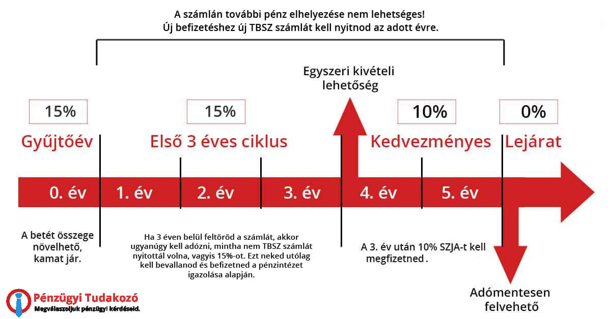

# Brókerek

## Adózás

Mielőtt belemegyünk a brókerek részleteibe, érdemes megemlíteni a részvények adózását. A részvények (és ugyebár ETF-ek) kereskedésére az [1995-ös SZJA törvény](https://net.jogtar.hu/jogszabaly?docid=99500117.TV) vonatkozik, azon belül is az ETÜ (ellenőrzött tőkepiaci ügylet) része. Röviden összefoglalva:

- a profitból 15% SZJA-t kell fizetni
- a veszteséget le lehet vonni az adóalapból (tehát ha 100 ezer forintot nyertél és 25 ezret vesztettél, akkor csak 75 ezer forint után kell adót fizetni)
- deviza esetében az aznapi MNB hivatalos árfolyamával kell kalkulálni

Szerencsére van rá mód, hogy ezt az adót elkerüld. :point_down:

### TBSZ

A TBSZ (tartós befektetési számla) egy olyan számla, amelyre értékpapírokat lehet vásárolni és ha 5 évig nem veszed ki a pénzt, akkor az adómentes.

Működése:

- van egy gyűjtőév (január 1 - december 31), amikor tehetsz rá pénzt, vehetsz, eladhatsz, kiutalhatsz, bármit csinálhatsz. A számlaneve tipikusan a gyűjtőévszám, tehát pl.: TBSZ 2021, TBSZ 2022, stb.
- a maradék 4 évben nem utalhatsz se ki, se be, viszont kereskedhetsz rajta (eladhatsz és vehetsz értékpapírokat)
    - tipikusan minden évben szokás nyitni egy új TBSZ-t.
- minimum 25 ezer forint beutalásával nyílik meg a TBSZ (törvényi előírás)
- fontos: **bármikor feltörheted ha mégis szükséged lenne pénzre**, csak akkor az adókedvezményt elveszíted. Nem tudod "újraaktiválni".
- ha a harmadik év után töröd fel, akkor 10%-ra csökken az SZJA
- az ötödik év **végén** (tehát pl. TBSZ 2021 az 2027 január 1-én) megszűnik a számla és adómentesen eladhatod az értékpapírjaid
    - vagy esetleg meg is hosszabbíthatod: ilyenkor nincs újabb gyűjtőév, tehát nem tudsz rá újabb pénzt tenni. Az első 5 év alatt megszerzett profit továbbra is adómentes marad, viszont az óra újra ketyeg: ha idő előtt feltörnéd, akkor az "újabb" profitokra kell csak adót fizetni.
- egy brókernél évente csak 1 TBSZ-t nyithatsz. Ha például szeretnél több TBSZ 2024-et, akkor több brókernél kell nyitnod. Különböző éveket természetesen ugyanazon brókernél is nyithatsz - tehát lehet TBSZ 2021, TBSZ 2022, TBSZ 2023 stb ugyanannál a brókernél.

Íme egy képben összefoglalva:

*Kép forrása: [penzugyi-tudakozo.hu](https://penzugyi-tudakozo.hu/tbsz/)*

!!! note "Állampapír"
    [Állampapírt](kotveny.md) fölösleges venni TBSZ-re, mert az amúgy is adómentes.

Mivel itt elsősorban a hosszútávú befektetésekről van szó, ezért mindig TBSZ-re érdemes venni értékpapírokat. A lenti brókerek listája azért szűkös, mert csak ők támogatják a TBSZ-t és náluk a legalacsonyabbak a költségek.

!!! note "Megjegyzés"
    A lentebbi brókerek nem magyarok és nem jelentenek a NAV-nak, ezért neked kell szólnod nekik a TBSZ megnyitásáról. Nagyjából 5 percet vesz igénybe és a brókerek pontosan megmondják, hogy mit kell tenned ([e-papíron](https://epapir.gov.hu/) küldeni egy üzenetet).

## Interactive Brokers

Az Interactive Brokers az egyik legjobb hírnevű bróker a világon. 1978-ban, több mint 45 éve alapították ([egy magyar származású üzletember](https://en.wikipedia.org/wiki/Thomas_Peterffy)) és a NASDAQ-on is jelen van. 14.1 milliárd dolláros tőkével rendelkezik és több mint két millió ügyfele van világszerte. Egyébként van egy pesti irodájuk is, itthon is fejlesztik a terméket.

Az IBKR mindig is jelen volt Európában, de a tavalyi év közepén lett igazán jó opció nekünk magyaroknak, mert ekkor vezették be a TBSZ-t hosszas várakozás után.

Költségek:

- deviza váltás: 0,2%, minimum 2 USD
- részvény és ETF kereskedés
    - USA: 0,0035 USD per részvény, de minimum 1 USD
    - Európa: 0,05%, de minimum 4 EUR
- TBSZ számla: 2000 Ft / hónap
    - fontos: ez nem szorzódik meg a számlád számaival. Tehát ha van TBSZ 2023-ad és TBSZ 2024-ed, akkor is csak 2000 Ft-ot kell fizetned.
    - az összeg "lefogyasztható". Ha például egy hónapban 1500 Ft költségeid voltak (pl devizaváltás vagy ETF kereskedés miatt), akkor arra a hónapra csak 500 Ft a TBSZ költség. Le is lehet nullázni.
    - a normál számládról vonja le a 2000-et, a TBSZ érintetlen marad.
- pénz beutalás ingyenes
- pénz kiutalás havi egyszer ingyenes

!!! tip "Tipp"
    Érdemes úgy vásárolni, hogy a minimum tranzakciós költséget elérd. Tehát ha 1000 euróért vásárolsz, akkor 4 euró a költség, de ha 300 euróért vásárolsz, akkor is 4 euró a költség. Magyarul érdemes lehet addig gyűjteni a pénzed, amíg nem éred el az 1000 eurót és csak utána vásárolni.

### Reputáció és biztonság

Az IBKR az egyik leghosszabb történelmű és legjobb hírnevű bróker Európában. Minden 2024 után nyitott magyar IBKR account az ír leányvállalathoz (IB Ireland vagy IBIE) tartozik. Az ír leányvállalat ügyfélvédelmi nyilatkozatát [itt](https://www.interactivebrokers.ie/en/general/security-investor-protection.php) találod. Röviden:

- Az ügyfelekhez tartozó készpénzt külön kezelik a sajátjuktól.
- A vagyonod 20 ezer euróig van biztosítva (European Investor Compensation Scheme).
- Értékpapírok az ügyfél saját nevén (erről [lentebb](#kozponti-ertektarak-central-securities-depository) olvass mindenképp!) <!-- markdownlint-disable-line MD051 -->

## Lightyear

A Lightyear egy új észt bróker, amelyet [2020-ban alapított](https://lightyear.com/eu/blog/why-i-joined-lightyear) két ex-Wise alkalmazott, [Martin Sokk](https://www.linkedin.com/in/martinsokk/) és [Mihkel Aamer](https://www.linkedin.com/in/mihkel-aamer-9099b918/). 2022-es Series A-ben 25 millió dollárt gyűjtöttek. A magyar piacot úgy tűnik kedvelik, mert az írás pillanatában a 19 álláshirdetésükből 4 magyar nyelvet igényel.

A Lightyear a szép és könnyen használható felhasználói felületével és a [kirívóan alacsony költségeivel](https://lightyear.com/eu/pricing) próbál betörni a piacra:

- ingyenes ETF kereskedés
- egyedi részvények 1€ per tranzakció
- devizaváltás 0.35%
- ingyenes beutalás (ha átutalás helyett bankkártyával fizetsz, akkor 0,5%)
- ingyenes kiutalás
- nincs havidíj vagy állományi díj

Hátránya lehet, hogyha egzotikus ETF-et keresel, nem biztos hogy a jelenleg listázott 160 között megtalálod. Van egy gomb, amivel viszont meg lehet igényelni.

### Reputáció és biztonság

A Lightyear gyakorlatilag még egy fiatal startup, ezért a megbízhatóságáról még csak kevés információ áll rendelkezésre. Én személyesen még rossz élményt nem olvastam, de érdemes személyesen utánajárni fórumokon. A biztonságról [a következőket](https://lightyear.com/eu/help/deposits-conversions-and-withdrawals/how-are-my-assets-protected) tudjuk:

- Az ügyfelek készpénzeit külön kezelik a sajátjuktól.
- A vagyonod 20 ezer euróig van biztosítva.
- Értékpapírok az ügyfél saját nevén (erről [lentebb](#kozponti-ertektarak-central-securities-depository) olvass mindenképp!) <!-- markdownlint-disable-line MD051 -->

## Bróker összessítés

| Bróker              | Reputáció  | Költségek                              |
| ------------------- | ---------- | -------------------------------------- |
| Interactive Brokers | Nagyon jó  | Alacsony, devizaváltás kifejezetten jó |
| Lightyear           | Ismeretlen | Nagyon alacsony                        |

## Központi értéktárak, Central securities depository

**Amikor egy brókeren keresztül vásárolsz egy értékpapírt (például egy ETF-et), annak te leszel a kizárólagos tulajdonosa.**

Miután megvásároltad az értékpapírt, a tőzsde továbbítja a vásárlás tényét egy központi értéktárnak ([CSD](https://en.wikipedia.org/wiki/Central_securities_depository)), ami a te nevedre jegyzi az értékpapírt. Példa: ha a Lightyear-en vagy az IBKR-en keresztül vásárolsz egy ETF-et a frankfurti (XETRA) tőzsdén, a XETRA ezt [egy Clearstream nevű szervezettel számolja el](https://www.xetra.com/xetra-en/clearing-settlement/settlement).

Ez azért jó, mert a brókered csődbemenetele esetén sem vesznek el a részvényeid, az CSD adatbázisában továbbra is szerepel. A nagyobb izgalomfaktor a készpénz, de ezt törvényileg külön kezelik a brókered pénzétől. Az európai 20 ezer euró biztosítás leginkább fraud esetén számít, amikor a bróker hazudott arról, hogy külön kezelte a pénzedet a sajátjától és elvesztette azt. Ezekre nagyon kicsi az esély, mert a pénzügyi intézményeket rendkívül szigorúan auditálják és rengeteg törvénynek kell megfelelniük.

!!! info
    A XETRA-nak [van egy egész érdekes white paper-je](https://www.xetra.com/resource/blob/2118064/f54f8c0f76584869513cc57edb4fd5ac/data/Innovative-solutions-for-settlement.pdf) az értékpapírok (és specifikusan ETF-ek kiemelve) és a CSD kapcsolatáról.

Volt csődre történelmi példa is: a [Lehman Brothers 2008-as csődje](https://en.wikipedia.org/wiki/Bankruptcy_of_Lehman_Brothers) az ügyfeleknek nem okozott kárt, a Barclays Bank 2 héten belül átvette az ügyfeleket.

!!! quote "Stephen Harbeck, a SIPC elnöke"
    "SPIC did not take any action because it wasn't necessary. All customer property is there." [Reuters](https://www.reuters.com/article/us-lehman-brokerageaccounts-idUSN155295120080915/), 2008, szeptember 15

    "Az SPIC (amerikai befektetővédelmi intézmény) nem tett semmilyen intézkedést, mert nem volt rá szükség. Minden ügyféltulajdon megmaradt."
