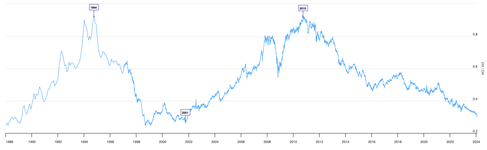
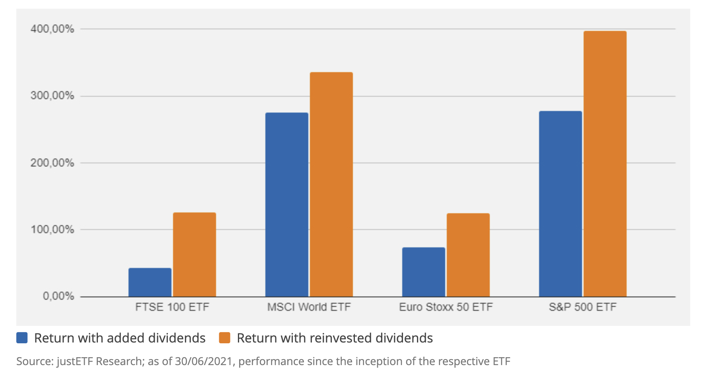
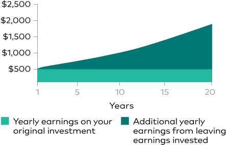
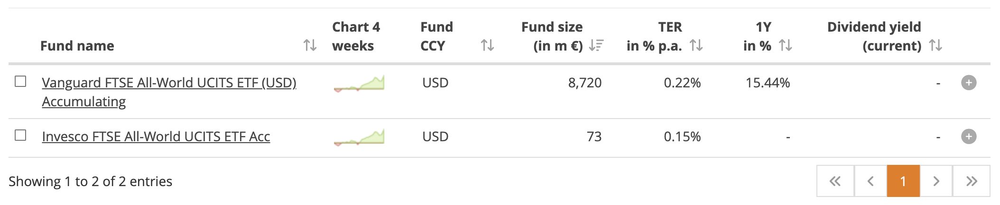

# ETF

Lehet, hogy amit itt elhangzik félelmetesnek hat először. Ez teljesen természetes. Nyilván nem kell instant az összes pénzedet ETF-ekbe fektetned. Az bőven jó, ha kicsiben kezdesz és szép lassan hozzászoktatod magad az érzéshez, hogy nem a bankszámládon pihen a pénzed.

:exclamation: Ne feledd: bármi, amit az interneten olvasol fenntartásokkal kezeld és járj utána magad is. Ehhez az [irodalom](irodalom.md) szekció segítséget nyújthat.

## MSCI World, FTSE All World

A két legnépszerűbb all-world indexek [korábban említve](reszveny.md#indexek) voltak: MSCI World és FTSE All World. Az lényegi különbség, hogy az előbbi csak a fejlett országokat tartalmazza, míg az utóbbi a fejlett és a feltörekvő piacokat egyaránt. Voltak olyan időszakok a történelemben, amikor a feltörekvő piacok jobban teljesítettek, mint a fejlettek, ezért érdemes lehet az FTSE All World-öt választani.

!!! hint "Összehasonlító cikk"
    [MSCI World vs. FTSE All World cikk](https://www.justetf.com/en/news/etf/msci-vs-ftse-which-etf-provider-is-the-best-index-provider.html). A konzekvencia, hogy MSCI World és az FTSE All World teljesítménye közt a különbség szabad szemmel [alig látható](https://portfolioslab.com/tools/stock-comparison/VWCE.DE/IWDA.L).

### Fejlett vs. feltörekvő piacok

*MSCI Emerging Markets vs MSCI World Index: Amikor az arány emelkedik, a feltörekvő piacok teljesítménye jobb, amikor csökken, akkor a fejlett országoké. 2010 óta a fejlett piacok állnak nyerésre, de vajon meddig?*

## Profit elosztás: Accumulating vs. Distributing

Két fő típusú ETF létezik: accumulating (felhalmozó) és distributing (osztalékfizető). Az ETF neve után általában van egy "Acc" vagy "Dis" rövidítés, ami ezt jelzi. Az accumulating ETF-ek a kifizetett osztalékot automatikusan újra befektetik az alapba, míg a distributing ETF-ek kifizetik az osztalékot. Szinte kivétel nélkül az accumulating ETF-eket érdemes választani, mert így nem kell manuálisan újra befektetni az osztalékot.

*Osztalék kivétele vs osztalék visszaforgatása. Forrás: [investor.vanguard.com](https://investor.vanguard.com/investor-resources-education/how-to-invest/risk-reward-compounding).*

## Melyik ETF-et vegyem?

Mielőtt rátérünk, kezdjünk egy gyors kitekintéssel. Ha amerikai fórumokon böngészel befektetési tanácsadást vagy amerikai YouTubert nézel, az amerikai tőzsdén kapható ETF-ek azonosítóit fogod hallani. VOO, VT, VTI, SPY, QQQ és társai. Ezeket az ETF-eket Európában nem tudod megvenni (legalábbis kisbefektőként nem). Ez azért van, mert az EU országokra más törvények vonatkoznak - egész konkrétan az [UCITS](https://ec.europa.eu/newsroom/fisma/items/29694). Ne bánkódj, mert az amerikai verzióknak általában van 1:1 megfelelője Európában is.

Barátkozz meg a [JustETF.com](https://www.justetf.com/en/)-mal, ami a legjobb barátod lesz az ETF-ek világában.

!!! tip "Tipp"
    A JustETF csak a lokációdnak megfelelő ETF-eket mutatja, véletlenül sem tudsz amerikaiba botlani.

Ha megnyitod a [screener](https://www.justetf.com/en/find-etf.html) oldalt, válaszd ki a "Matching Indices"-nél az általad választott indexet, mondjuk FTSE All World-öt. A "Use of Profit"-ot állítsd accumulating-re. Az eredményt pedig rendezd "Fund Size" szerint csökkenő sorrendbe. Így a legnagyobb méretű ETF-eket fogod látni, ami általában a legjobb választás. [Direkt link](https://www.justetf.com/en/find-etf.html?groupField=none&sortField=fundSize&sortOrder=desc&index=FTSE+All-World&columnValueType=currentDividendYield&distributionPolicy=distributionPolicy-accumulating).

A képernyőkép készítés időpontjában csupán két darab ilyen ETF van, a Vanguard-é és az Invesco-é. A képen látszik továbbá, hogy a Vanguard 8720 millió, amíg az Invesco "csak" 73 millió eurót kezel. Az Invesco oldalán az alacsonyabb költség (0.15% vs 0.22%), a Vanguard oldalán pedig a nagyobb tőke és renomé szól. A hozamuk valószínűleg tizedpontossággal megegyezik, de ezt próbáld te kinyomozni. :slight_smile:

!!! info "TER"
    A TER (Total Expense Ratio) az ETF éves költsége, amit a kezelt vagyon százalékában mérnek. Minél alacsonyabb, annál jobb. A TER teljesen "átlátszó" a befektető számára, neked semmit nem kell fizetned, mert a költségek már benne vannak az árfolyamban. [A teljes történet kicsit összetettebb](https://www.justetf.com/en/news/etf/cost-of-etfs-total-expense-ratio-ter-vs-total-cost-of-ownership-tco.html).

!!! question "Házi feladat"
    Keresd ki JustETF-en a legpopulárisabb MSCI World ETF-et. Nézd meg, hogy melyik cégé és hogy mit lehet tudni a cégről.

Ha megnyitod az ETF oldalát és a legaljára tekersz a "Listings" részhez, látni fogod, hogy milyen azonosítóval (ticker) találod meg az ETF-et a különböző tőzsdéken. Általában ezen a néven is becézik őket (pl. VWCE). Van egy egyedi azonosítója is, aminek ISIN a neve és kicsit kevésbé megjegyezhetőbb. Legsűrűbben a frankfurti (XETRA) és a londoni (London Stock Exchange) tőzsdét használjuk, de attól is függ, hogy milyen pénznemben szeretnéd megvenni az ETF-et.

!!! info "Pénznem"
    A pénznem teljesen mindegy, az árfolyam pont ugyanúgy változik. Válaszd azt, ami kényelmesebb.

## Hol vegyem meg?

A tőzsdékről nem tudsz közvetlenül vásárolni, ehhez egy brókerre van szükség. Lásd a [brókerek](brokerek.md) oldalt.

## Hogyan adózom utána?

Ez a rész is a [brókerek](brokerek.md) oldalon található.

## Stratégia

A [stratégia](strategia.md) oldalon találsz pár tanácsot.
