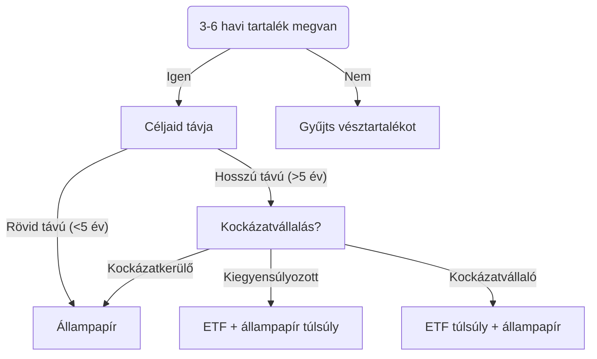

# Flowchart

## Magyarázat

### 3-6 havi vésztartalék

Pár havi biztonsági tartalékot érdemes félretenni, hogy váratlan kiadások esetén ne kelljen likvidálni a befektetéseid vagy hitelt felvenni. Több információt a [Vésztartalék](vesztartalek.md) oldalon találsz.

### Céljaid távja

A befektetési lehetőségek kiválasztásánál fontos szempont, hogy mennyi időre tervezel befektetni. A rövid távú befektetések esetén a kockázatot érdemes minimalizálni, míg a hosszú távú befektetések esetén érdemes kockázatot vállalni, hogy a hozamok is magasabbak legyenek.

Példa: ha lakást szeretnél venni 3 éven belül, akkor kockázatos lehet részvényekbe befektetni, mert a rövid távú hozamokat nem lehet előre tudni. Mi van ha jön egy recesszió és a befektetésed értéke 3 év alatt 50%-ot esik?

### Állampapír

Az állampapír az egyik biztonságosabb befektetési lehetőség, amelyet a Magyar Államkincstár kínál. Több információt az [Kötvények](kotveny.md) oldalon találsz.

### ETF

Az ETF (Exchange Traded Fund) egy olyan befektetési alap, amely a tőzsdén kereskedhető. Az ETF-ek a hosszútávú befektetések egyik legpopulárisabb formái. Kezdd az olvasást a [Részvény](reszveny.md) oldalon.

## Stratégia

Ha végig olvastad a fenti oldalakat, a [stratégia](strategia.md) oldalon találsz egy összefoglalót, hogy milyen befektetési stratégiát érdemes követni.
