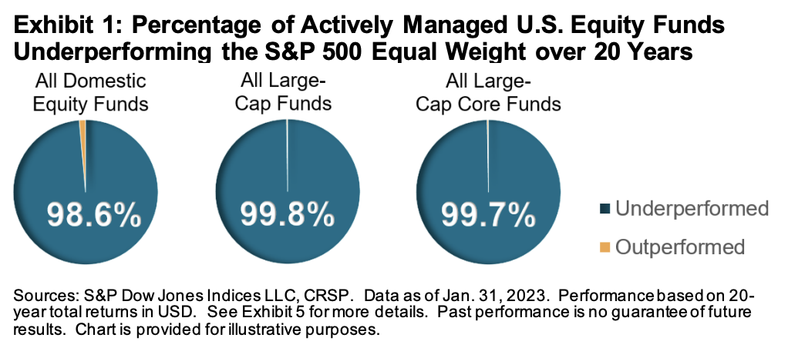

# Részvénypiaci befektetések

A részvények a legnyereségesebb hosszútávú befektetések közé tartoznak. Azonban a részvények árfolyama ingadozó, és a tőzsdei szereplőknek sok tudást és időt kell befektetniük ahhoz, hogy a megfelelő vállalatokat kiválasszák. Az index alapú befektetések (ETF-ek) ezen a problémán segítenek.

!!! note "Történelem"
    [John Bogle](https://en.wikipedia.org/wiki/John_C._Bogle) a tőzsdetörténelem egyik legnagyobb alakja és az index alapú befektetések atyja. Ő volt a [Vanguard Group](https://en.wikipedia.org/wiki/The_Vanguard_Group) alapítója és vezérigazgatója, és neki tulajdonítják az indexalapok népszerűsítését. Maga is lelkes befektető és pénzkezelő volt, a spekuláció helyett a befektetést, a rövid távú kereskedés helyett a hosszú távú türelmet és a brókeri díjak lehető legnagyobb mértékű csökkentését hirdette.

    Bogle nevéhez fűződik az egyik legelső indexalap, a Vanguard 500 Index Fund (1976) megalkotása is, ami az [S&P 500](#indexek) indexet követte.

Mielőtt mélyebben belemennénk az ETF-ekbe, érdemes megérteni, hogy mi az az index, és miért jobb az index alapú befektetés, mint az egyedi részvényekbe való befektetés.

## Indexek

Az indexek egyfajta "kosarak" a tőzsdén jegyzett részvényekből, amelyeket a tőzsdei szereplők használnak arra, hogy a piac teljesítményét mérjék.

Egy index általában egy adott ország, régió, vagy iparág legnagyobb vállalatait tartalmazza. Az indexeket a tőzsdék vagy független szervezetek állítják össze, és a részvények piaci kapitalizációja (a részvények száma szorozva az árfolyammal) alapján súlyozzák. Például:

- Az [S&P 500](https://en.wikipedia.org/wiki/S%26P_500) az Egyesült Államok 500 legnagyobb vállalatát tartalmazza. Az [S&P Global Ratings](https://en.wikipedia.org/wiki/S%26P_Global_Ratings) nevű hitelminősítő cég üzemelteti.
- A [Dow Jones](https://en.wikipedia.org/wiki/Dow_Jones_Industrial_Average) az Egyesült Államok 30 *legfontosabb* vállalatát tartalmazza. Egy bizottság dönt a tartalmáról és [pár évente frissítik](https://en.wikipedia.org/wiki/Historical_components_of_the_Dow_Jones_Industrial_Average).
- A [NASDAQ-100](https://en.wikipedia.org/wiki/Nasdaq-100) az Egyesült Államok 100 legnagyobb nem pénzügyi vállalatát tartalmazza.
- Az [MSCI World](https://en.wikipedia.org/wiki/MSCI_World) iparágtól függetlenül a világ 23 [fejlett országának](https://en.wikipedia.org/wiki/Developed_market) vállalatait tartalmazza. Mikor valaki azt mondja, hogy "a piac teljesítménye", akkor valószínűleg erre az indexre gondol. 1970-ben indult, ezért történelmi adatok is rendelkezésre állnak.
- Az [FTSE All World Index](https://research.ftserussell.com/Analytics/FactSheets/temp/affafdfe-a680-4085-afd5-b1d90c25c411.pdf) (becézve "footsie") a Föld minden táján található nagy és közepes kapitalizációjú vállalatok részvényeinek piaci teljesítményét méri. Mintegy 4000 részvényt tartalmaz közel 50 országban, beleértve a fejlett és a [feltörekvő piacokat](https://en.wikipedia.org/wiki/Emerging_market) is. A globális befektethető piaci kapitalizáció több mint 95%-át fedi le.

| Index neve     | Ország    | Vállalatok száma | Típus                        |
| -------------- | --------- | ---------------- | ---------------------------- |
| S&P 500        | USA       | 500              | nagyvállalatok               |
| Dow Jones      | USA       | 30               | nagyvállalatok               |
| NASDAQ-100     | USA       | 100              | nem pénzügyi vállalatok      |
| MSCI World     | 23 ország | ~1500            | fejlett országok             |
| FTSE All World | 50 ország | ~4000            | fejlett és feltörekvő piacok |

## Egyedi részvények vs. index alapú befektetési formák

[Millió könyv](irodalom.md#konyvek) íródott arról, hogy miért rossz ötlet egyedi részvényekbe fektetni, de most foglaljuk össze röviden:

- **Tudás**: Az egyedi részvények kiválasztása és figyelése sok tudást igényel, míg az indexekbe fektetéshez elég egy kis alapismeret.
- **Kockázat**: Egy vállalat bármikor csődbe mehet, de egy index nem. Az is elég, ha a CEO egy rossz szót szól és az árfolyam bezuhan.
- **Költségek**: Ha egy diverzifikált egyedi részvény portfóliót tartasz fent, az több tranzakcióval jár, mint egy darab index. Több tranzakció = nagyobb költség.
- **Idő**: Az egyedi részvények kiválasztása és figyelése sok időt vesz igénybe, míg az indexekbe fektetés passzív, és csak pár kattintásba kerül. Nem kell aktívan figyelni a piacot és folyamatosan ellenőrizni, hogy megfelelő döntéseket hoztál-e.
- **Diverzifikáció**: Egy index sok vállalatot és iparágat tartalmaz, míg egy egyedi részvény csak egyet.
- **Stressz**: Az egyedi részvények árfolyama jobban ingadozik (volatilitás), mint az indexeké. Az árfolyam ingadozások stresszt okozhatnak, ami befolyásolhatja a döntéseidet.

!!! quote "John C. Bogle"
    “Don't look for the needle in the haystack. Just buy the haystack!”

    "Ne keress tűt a szénakazalban. Vedd meg a szénakazalt!"

## Alapok formái

A két legelterjedtebb befektetési forma a tőzsdén kereskedhető alap (ETF - Exchange Traded Fund) és a befektetési alap (mutual fund). (Igen, elég szerencsétlenek a magyar fordítások.)

A befektetési alapokat tipikusan bankok és egyéb pénzügyi szolgáltatók kínálják és aktívan kezelik őket. Ezzel szemben az ETF-ek - ahogy neve is sugallja - szimplán megvásárolhatóak a tőzsdén is, pont úgy, mint a hagyományos részvények. Tipikusan egy [indexet](#indexek) vagy egy szektort követnek. Akad másfajta is, de az egyszerűség kedvéért lentiekben az ETF-ekre mindig az index alapú befektetéseket értjük.

## Aktív vs. passzív alapok

Aktív alapok:

- Céljuk, hogy a piac teljesítményét megelőzzék.
- Portfólió menedzserek kezelik, akik "kézzel" válogatják össze a portfólióban lévő részvényeket.
- Magas költségekkel járnak, mivel a menedzsereknek fizetni kell a munkájukért.

Passzív alapok:

- Célja, hogy egy adott index teljesítményét kövessék.
- Alacsonyabb költségekkel járnak, mivel nincs szükség portfólió menedzserekre. Az alapokat algoritmusok kezelik, amik pontosan igyekeznek követni az indexet.
  
Az elmúlt évtizedek során elvégzett [tanulmányok](https://www.scirp.org/journal/paperinformation?paperid=92983) egyértelműen kimutatták, hogy az aktívan menedzselt alapok átlagban **nem tudják megelőzni az indexek teljesítményét**. Cserébe viszont magasabb költségekkel járnak, ami hosszú távon jelentős különbséget jelent a hozamokban.

[Az S&P benchmark-ja](https://www.spglobal.com/spdji/en/documents/research/research-more-equal-than-others-20-years-of-the-sp-500-equal-weight-index.pdf) 2003 és 2023 között:

*Az aktívan kezelt alapok 99%-ban alul teljesítették az S&P 500 indexet 20 éves időtávon.*

### Konzekvencia

A fentiek alapján az ETF-ek a legjobb választásnak tűnnek a hosszútávú befektetésekhez.

A szakemberek egyetértenek abban, hogy egy all-world index alapú ETF-nek kell dominálnia a portfóliódat. Sőt, bőven elég ha egyetlen egy darab ETF-et tartasz fent. A legtöbb ETF amúgy is fedésben van egymással, így többet tartani felesleges.

!!! quote "John C. Bogle"
    "When there are multiple solutions to a problem, choose the simplest one"

    "Ha egy problémára több megoldás is létezik, válaszd a legegyszerűbbet."

## Folytatás

Az ETF-ekről további részleteket az [ETF](etf.md) oldalon találsz.
