# Stratégia

A világ legjobb befektetési stratégiája nem létezik, de vannak olyan alapelvek, amelyeket érdemes figyelembe venni. A "vita" gyakorlatilag arról szól, hogy a portfóliód mekkora részét rakd a [részvénypiacra](reszveny.md) és mekkorát [kötvényekbe](kotveny.md).

De ha a részvények hozama magasabb, akkor miért fektessünk kötvényekbe is?

A válasz az, hogy a részvények hozama ugyan *általában* magasabb, de a kockázata is. Egy jó példa erre a 2000-es [dotcom lufi](https://hu.wikipedia.org/wiki/Dotkomlufi) robbanása utáni évtized, amikor a részvénypiac oldalazott, míg a kötvénypiac hozama nőtt.

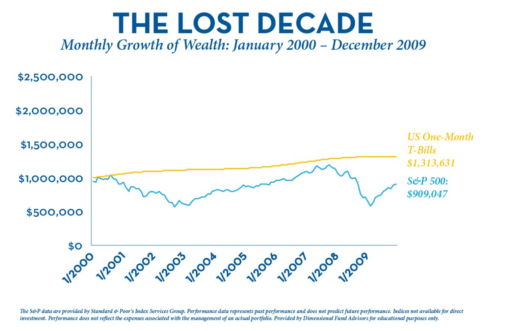

A fenti ábrán az látszik, hogy amíg az [S&P 500](reszveny.md#indexek) fetrengett, addig az amerikai kincstárjegyek hozama stabil volt.

Persze, mire magához tért a részvénypiac, meg is érkezett a 2008-as [gazdasági világválság](https://hu.wikipedia.org/wiki/A_2008-ban_kirobbant_gazdas%C3%A1gi_vil%C3%A1gv%C3%A1ls%C3%A1g):

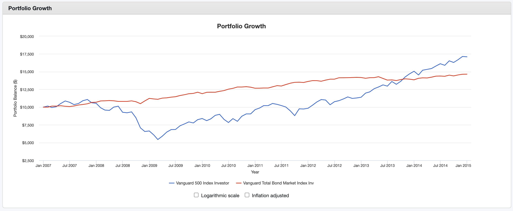
*A fenti ábrán a kék vonal az [S&P 500](reszveny.md#indexek), a piros pedig a kötvénypiac hozamai.*

Tehát **a kötvények recesszió idején tompítják az esést**. Persze az is látszik, hogyha elég türelmes vagy, akkor hosszútávon a részvényekkel jártál jobban. 2009-től stabilan emelkedett a részvénypiac.

!!! warning "Megjegyzés"
    Ne feledd: a múltbeli eredmények nem garantálják a jövőbeli eredményeket.

## Eszközallokáció

Az alapelv az az, hogy minimalizálni kell a kockázatot a nyugdíjhoz közeledve. Mit szólnál, ha 60 évesen a teljes vagyonod részvényekben lenne és beütne egy újabb hosszú recesszió? Ilyen korban az idő már nem a te oldaladon van. Ugyanakkor egy 20 évesnek szinte tök mindegy, sőt, talán jól is jön neki, hisz a piac alján alaposan be tud vásárolni.

Egy old-school megközelítés, a százalékos szabály: az életkorod százalékát fekteted kötvényekbe, a maradékot pedig részvényekbe. Tehát ha 30 éves vagy, akkor 30%-ot kötvényekbe, 70%-ot részvényekbe fektetsz.

Modernebb módszer a 120-életkor: 120-ból kivonod az életkorod, és a maradékot fekteted részvényekbe. Tehát ha 30 éves vagy, akkor 90%-ot részvényekbe, 10%-ot kötvényekbe fektetsz.

| Életkor | Részvény arány | Kötvény arány |
| ------- | -------------- | ------------- |
| 20      | 100%           | 0%            |
| 30      | 90%            | 10%           |
| 40      | 80%            | 20%           |
| 50      | 70%            | 30%           |
| 60      | 60%            | 40%           |
| 70      | 50%            | 50%           |

A döntéskor vedd figyelembe, hogy hány éves vagy, milyen az egészséged (várható élettartam, betegségek a családban), gyerekeid vannak-e, milyen a munkahelyi biztonságod, milyen a jövedelmed, mekkora a [vésztartalékod](vesztartalek.md), milyen a hozzáállásod a kockázathoz stb. Hogyan viselnéd, ha a portfóliód értéke 40%-kal csökkenne egy év alatt? Bepánikolnál? Ha igen, akkor emeld a kötvények arányát.

## Példa portfóliók

### Konzervatív

| Eszköz                       | Arány |
| ---------------------------- | ----- |
| [Kötvény](kotveny.md)        | 70%   |
| [All-World ETF](reszveny.md) | 30%   |

Tipikusan nyugdíj előtt állóknak.

### Defenzív

| Eszköz                       | Arány |
| ---------------------------- | ----- |
| [Kötvény](kotveny.md)        | 40%   |
| [All-World ETF](reszveny.md) | 60%   |

### Kockázatvállaló

| Eszköz                       | Arány |
| ---------------------------- | ----- |
| [Kötvény](kotveny.md)        | 10%   |
| [All-World ETF](reszveny.md) | 90%   |

Akik hosszútávon gondolkodnak, és nem ijednek meg a hullámvasúttól.

### Backtest

Ugyan nem szabad múltbeli eredményekre alapozni, de talán lehet tanulni belőle. Nézzük meg, hogy mi lett volna ha a fentebbi 3 portfóliót a történelmünk különböző időszakaiban indítottuk volna el.

A részvénypiacot a VTSMX, a kötvénypiacot pedig a VBMFX alapokkal modellezem. A [portfoliovisualizer.com](https://www.portfoliovisualizer.com/)-ot használtam fel.

#### 1993-2024

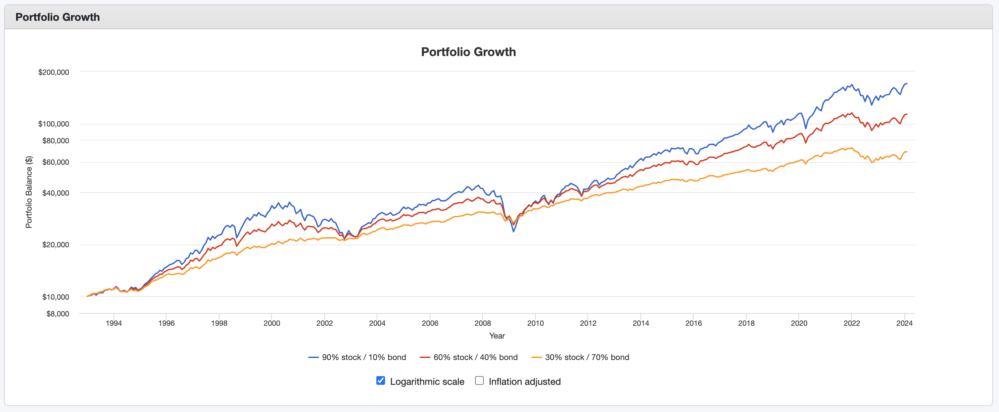
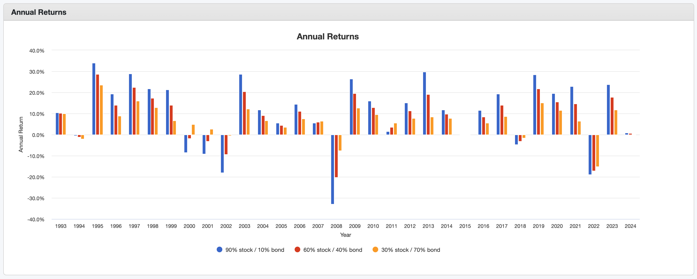
*A 90-es évek elején még időben szállhattál be a buliba.*

#### 1999-2024

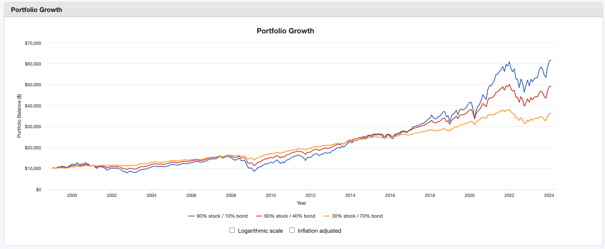
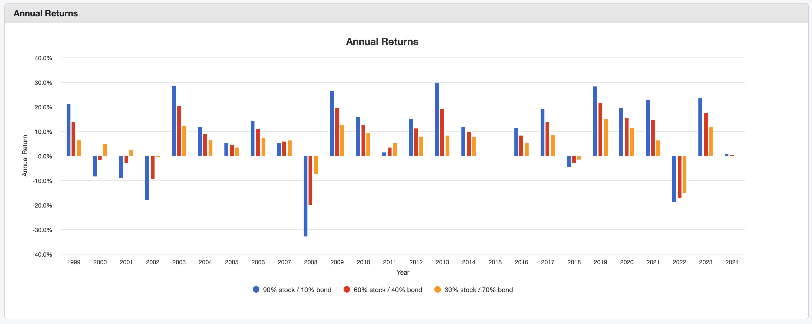
*Ha 1999-ben akartad meglovagolni a dotcom lufit, akkor egy részvény-túlsúlyú portfólióval egészen 2004-ig izzadtál volna, mint 💃 a ⛪️.*

#### 2009-2024

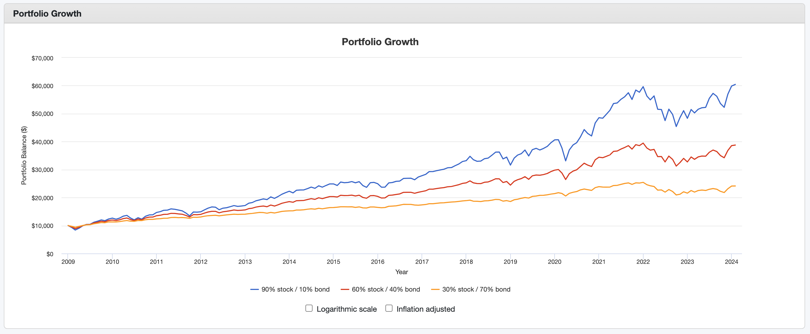
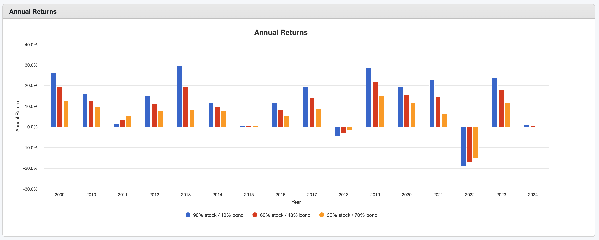
*2009-ben padlóra került a piac, utána viszont jött egy hosszú bika piac. Egy kicsit belerondított a COVID és az ukrán-orosz háború.*

#### 2019-2024

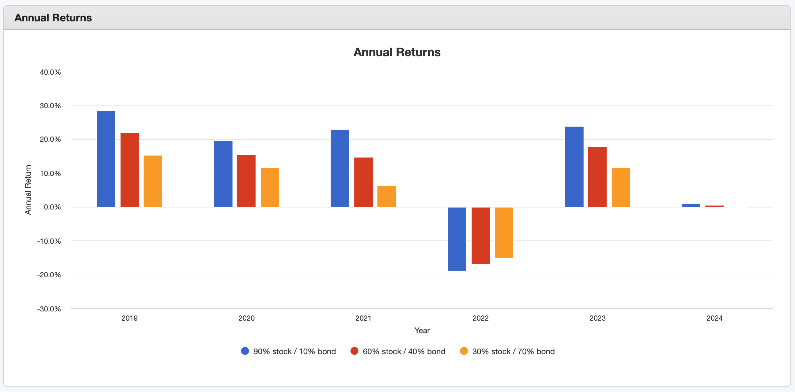
*A COVID 2020 januárjában érkezett meg igazán. Ha ekkor már 1 éve tartott volna a portfóliód, egész gyorsan talpra álltál volna. Az orosz-ukrán háború hatása sem tartott sok ideig.*

!!! quote "John C. Bogle"
    "The winning formula for success in investing is owning the entire stock market through an index fund, and then doing nothing. Just stay the course."

    "A befektetésben a siker nyerő receptje az, ha egy indexalapon keresztül a teljes részvénypiacot birtokoljuk, és aztán nem csinálunk semmit. Csak maradj a pályán."

## Rendszeresség, a piac időzítése

*"Time in the market beats timing the market."* - az egyik legidősebb bölcselet. A piacon eltöltött idő megveri a piac időzítést. Az időzítése nem működik, mert nem tudhatod előre, hogy mikor lesz a piac alja vagy a teteje. **Vásárolj rendszeresen, ne foglalkozz a piac mozgásával.**

### Putnam Investments

Az alábbi adatokat a Putnam Investments [gyűjtötte össze](https://www.putnam.com/individual/infographics/time-not-timing/). Bemutatja, hogy az S&P 500-as index 10 000 dolláros növekedését 2007. december 31. és 2022. december 31. között:

| Ha te                          | Egyenleg | Hozam  |
| ------------------------------ | -------- | ------ |
| 15 évig bent maradtál a piacon | 45 682   | 10.66% |
| Kihagytad a legjobb 10 napot   | 20 929   | 5.05%  |
| Kihagytad a legjobb 20 napot   | 12 671   | 1.59%  |
| Kihagytad a legjobb 30 napot   | 8 365    | -1.18% |
| Kihagytad a legjobb 40 napot   | 5 786    | -3.58% |

### JP Morgan

Ugyanezen a vonalon.

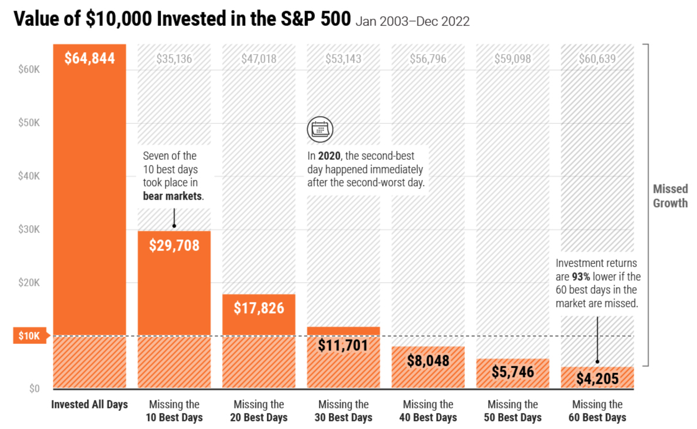
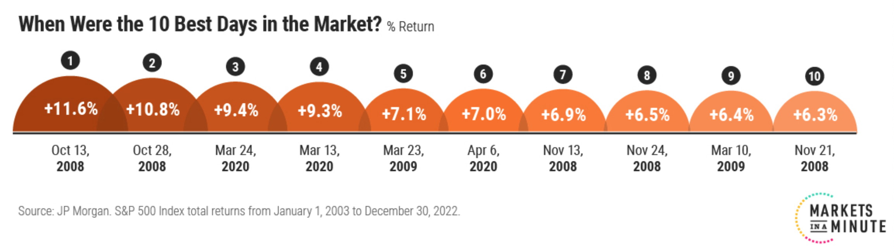

### Morningstar

A Morningstar egyik CFA-ja [ezt írta](https://www.morningstar.com/portfolios/staying-invested-beats-timing-marketheres-proof):

> Két portfólió hozamát számoltuk ki, amelyeket rendszeres jövedelmekből építettünk fel. Az első, a Steady Equity megközelítés minden jövedelmet a Morningstar US Market Indexbe fektet. A második, a Valuation Aware, ugyanebbe az indexbe fektet, amikor a részvények alulértékeltnek tűnnek, de egyébként hajlandó készpénzt tartani egy vonzóbb időszakig.

*Forrás: morningstar.com*
